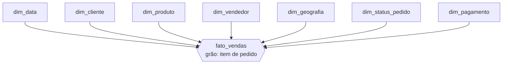
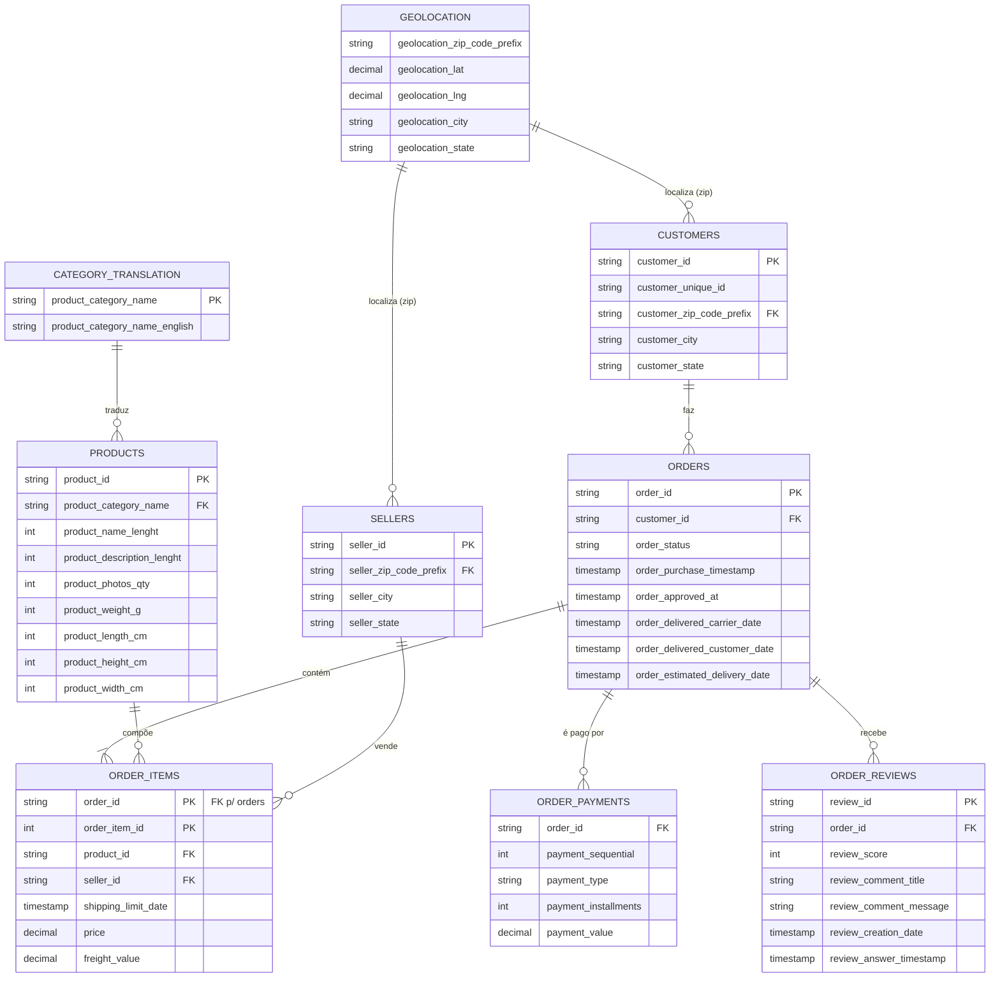
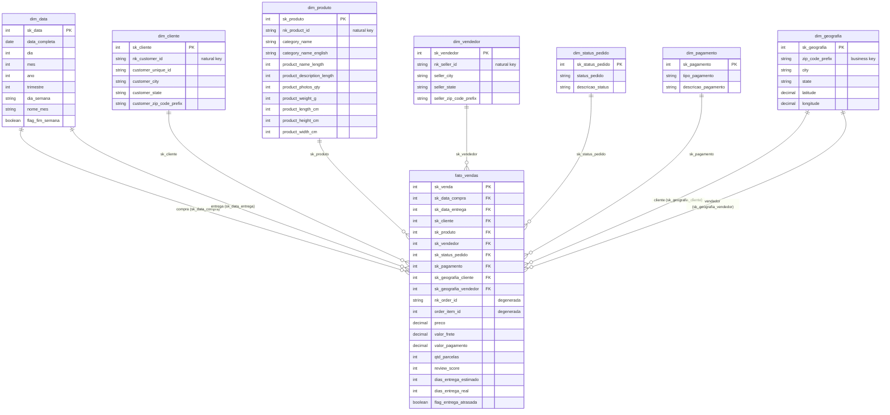
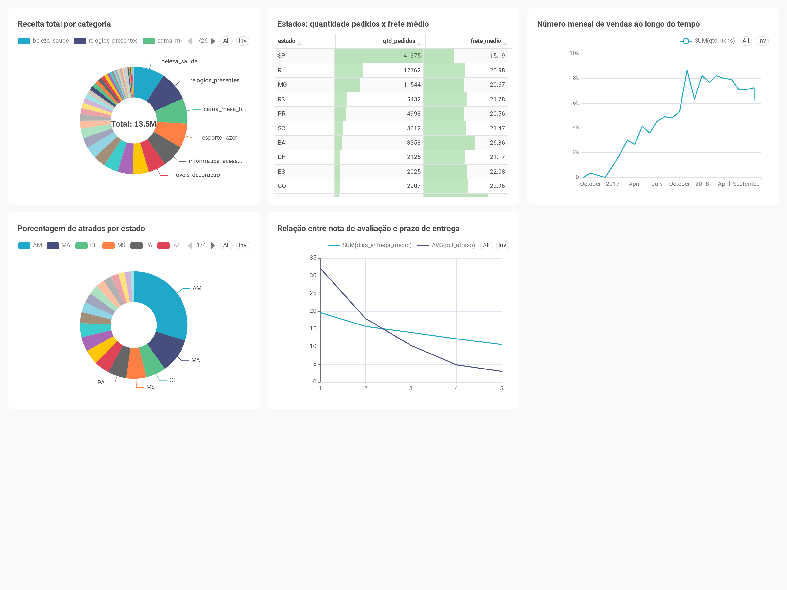

# Cloud Analytics com Olist — Avaliação Final TADB

> Arquitetura moderna de dados na nuvem sobre os dados públicos da **Olist**: modelagem de um Data Warehouse (Star Schema) em PostgreSQL/Supabase, pipeline de ETL com Apache Hop e visualização de insights no Preset.io (Apache Superset).

---

## Equipe

| Nome |
|---|
| Adelson Santos Lima Junior |
| Náthally Alves da Silva Braz|
| Suellen Lima da Silva |
| Suzana de Souza Santos |
| Vitória Marques dos Santos |

---

## Sobre o Projeto

Este projeto é a avaliação final da disciplina **Tópicos Avançados em Banco de Dados (TADB)**. O objetivo é construir uma **arquitetura moderna de dados na nuvem** ponta-a-ponta, utilizando os dados públicos do marketplace brasileiro **Olist**.

O fluxo cobre:

1. **Modelagem dimensional** (Star Schema)
2. **ETL** com Apache Hop (extração, transformação e carga)
3. **BI e análise** com Preset.io (Apache Superset)
4. **Relatório final** consolidado

> **Fonte dos dados:** [github.com/olist/work-at-olist-data](https://github.com/olist/work-at-olist-data)
> CSVs locais em [`datasets/`](datasets/).

---

## Organização do Repositório

```
tadb-avaliacao-final/
├── datasets/                        # CSVs originais da Olist (dados brutos)
│   ├── olist_customers_dataset.csv
│   ├── olist_geolocation_dataset.csv
│   ├── olist_order_items_dataset.csv
│   ├── olist_order_payments_dataset.csv
│   ├── olist_order_reviews_dataset.csv
│   ├── olist_orders_dataset.csv
│   ├── olist_products_dataset.csv
│   ├── olist_sellers_dataset.csv
│   └── product_category_name_translation.csv
├── docs/
│   ├── etapa1-modelagem.md          # Documentação completa da Etapa 1
│   ├── etapa2-etl.md                # Documentação + tutoriais da Etapa 2 (ETL)
│   └── etapa3-bi.md                 # Documentação da Etapa 3 (BI no Preset.io)
├── sql/                             # Scripts SQL do Data Warehouse
│   ├── 01_schema.sql                # cria schemas dw + stg (estrutura, do zero)
│   ├── 02_fato.sql                  # monta dw.fato_vendas a partir do staging
│   └── 03_views_bi.sql              # schema bi: 5 views de negócio (Preset)
├── etl/                             # Apache Hop: ETL local → Supabase
│   ├── pipelines/                   # .hpl (dimensões + staging)
│   ├── workflows/                   # .hwf (dimensões, staging, carga completa)
│   ├── metadata/rdbms/              # conexão JDBC supabase_dw
│   ├── config/                      # credenciais do Supabase (.example versionado)
│   └── project-config.json
├── docker-compose.yml               # Apache Hop em container (hop-web + hop-run)
└── README.md
```

---

## Etapas do Projeto

| Etapa | Conteúdo | Status |
|---|---|---|
| **1 — Modelagem Dimensional** | [`docs/etapa1-modelagem.md`](docs/etapa1-modelagem.md) — modelo relacional e dimensional, DER físico, planilhas e DDL | Concluído |
| **2 — ETL (Apache Hop)** | [`docs/etapa2-etl.md`](docs/etapa2-etl.md) — pipelines `.hpl`, workflows `.hwf` e tutoriais de setup (Supabase + Hop) | Concluído |
| **3 — BI e Análise (Preset.io)** | [`docs/etapa3-bi.md`](docs/etapa3-bi.md) — 5 views de negócio, dashboard ([imagem](images/olist-bi.png)) e [relatório PDF](docs/relatorio-etapa3.pdf) | Concluído |
| **4 — Relatório Final** | Documento consolidado com todas as etapas e conclusões | Pendente |

---

## Dataset — Olist

Os dados são provenientes do marketplace Olist e cobrem pedidos realizados entre **2016 e 2018**.

| Arquivo | Descrição | Tamanho aprox. |
|---|---|---|
| `olist_customers_dataset.csv` | Dados dos clientes (cidade, estado, CEP) | ~8,3 MB |
| `olist_geolocation_dataset.csv` | Coordenadas geográficas por CEP | ~59 MB |
| `olist_order_items_dataset.csv` | Itens de cada pedido (produto, vendedor, preço, frete) | ~14 MB |
| `olist_order_payments_dataset.csv` | Pagamentos dos pedidos (tipo, parcelas, valor) | ~5,5 MB |
| `olist_order_reviews_dataset.csv` | Avaliações dos clientes (nota de 1 a 5) | ~13,8 MB |
| `olist_orders_dataset.csv` | Pedidos (status, datas de compra, aprovação, entrega) | ~17 MB |
| `olist_products_dataset.csv` | Catálogo de produtos (categoria, dimensões físicas) | ~2,3 MB |
| `olist_sellers_dataset.csv` | Dados dos vendedores (cidade, estado, CEP) | ~163 KB |
| `product_category_name_translation.csv` | Tradução das categorias PT → EN | ~2,5 KB |

---

## Etapa 1 — Modelagem Dimensional

> Documentação completa: **[docs/etapa1-modelagem.md](docs/etapa1-modelagem.md)**

### Processo de Negócio

**Venda de itens em pedidos do marketplace Olist** — desde a compra, passando pelo pagamento e logística de entrega, até a avaliação do cliente.

### Granularidade

> **1 linha da `fato_vendas` = 1 item de um pedido**

A chave natural do grão é a combinação **`order_id` + `order_item_id`**, provida pelo arquivo `olist_order_items_dataset.csv`. É a menor unidade transacional que conecta simultaneamente cliente, produto, vendedor, data, status e pagamento.

### Modelo Dimensional — Visão de Alto Nível



| Dimensão | Papel analítico | SCD |
|---|---|---|
| `dim_data` | Tempo (compra e entrega) — usada 2× via *role-playing* | Tipo 0 (fixa) |
| `dim_cliente` | Quem comprou | Tipo 1 (sobrescreve) |
| `dim_produto` | O que foi vendido (categoria, dimensões físicas) | Tipo 1 (sobrescreve) |
| `dim_vendedor` | Quem vendeu (lojista parceiro) | Tipo 1 (sobrescreve) |
| `dim_geografia` | Onde (localização de cliente e vendedor via CEP) | Tipo 0 (fixa) |
| `dim_status_pedido` | Situação do pedido | Tipo 0 (fixa) |
| `dim_pagamento` | Como foi pago | Tipo 0 (fixa) |

### Modelo Relacional de Origem



### DER Físico — Star Schema



**Notas de modelagem:**

- **Role-playing dimension:** `dim_data` é referenciada duas vezes (`sk_data_compra` e `sk_data_entrega`).
- **Dimensão degenerada:** `nk_order_id` e `order_item_id` permanecem na fato para rastreabilidade ao pedido original (sem dimensão própria).
- **Surrogate keys:** todas as dimensões usam SK numérica (`SERIAL`), exceto `dim_data`, cuja SK é inteligente no formato `YYYYMMDD`.
- **Registro -1:** cada dimensão possui um membro `-1` ("N/A") para tratar fatos sem correspondência (ex.: pedido não entregue → `sk_data_entrega = -1`).

### Mapeamento Origem → Dimensional

| Tabela de Origem | Destino Dimensional |
|---|---|
| `olist_orders` + `olist_order_items` | `fato_vendas` (grão de item) |
| `olist_orders.order_purchase/_delivered` | `dim_data` (role-playing) |
| `olist_customers` | `dim_cliente` |
| `olist_products` + `category_translation` | `dim_produto` |
| `olist_sellers` | `dim_vendedor` |
| `olist_geolocation` | `dim_geografia` (agregado por CEP) |
| `olist_orders.order_status` | `dim_status_pedido` |
| `olist_order_payments.payment_type` | `dim_pagamento` |
| `olist_order_payments`, `olist_order_reviews` | métricas da `fato_vendas` |

### Qualidade de Dados e Transformações

| Tema | Problema na origem | Tratamento |
|---|---|---|
| **Categorias nulas** | `product_category_name` ausente em alguns produtos | Mapeado para `category_name = 'sem_categoria'` / `category_name_english = 'unknown'` |
| **Tradução de categoria** | Categoria só em português na origem | Join com `product_category_name_translation` para popular `category_name_english` |
| **Pedidos sem entrega** | `order_delivered_customer_date` nulo (pedido cancelado/em trânsito) | `sk_data_entrega = -1`; `dias_entrega_real = NULL` |
| **Clientes recorrentes** | `customer_id` muda por pedido; `customer_unique_id` é estável | `customer_unique_id` mantido na dimensão para deduplicação analítica |
| **Geolocalização duplicada** | Múltiplas coordenadas por prefixo de CEP | `dim_geografia` agrega por CEP usando **média** de lat/lng |
| **Membros ausentes** | Fatos sem dimensão correspondente | Registro `-1` ("N/A") em todas as dimensões |
| **SLA de entrega** | Não existe na origem | Calculado: `dias_entrega_*` e `flag_entrega_atrasada` (real > estimada) |

> **Limitação — rateio de pagamento:** a granularidade da fato é *item de pedido*, mas os pagamentos existem no nível de *pedido*. O campo `valor_pagamento` é **rateado proporcionalmente** ao `preco` de cada item dentro do pedido. Análises que exijam exatidão de pagamento devem agregar no nível de `nk_order_id`.

### Artefatos da Etapa 1

| Artefato | Descrição |
|---|---|
| [`sql/01_schema.sql`](sql/01_schema.sql) | DDL completo (schemas `dw` + `stg`): tabelas, PKs, FKs, índices, carga das dimensões fixas e membros `-1` |
| [Planilha de mapeamento (Google Sheets)](https://docs.google.com/spreadsheets/d/1pjmR3teW512zpyd4wkox4JWPSOrz8AR-k7yAkT8H_Xs/edit?usp=sharing) | 8 abas de documentação detalhada (fato + 7 dimensões) com atributos, descrições, valores de amostra e tipo de SCD |

---

## Etapa 2 — ETL com Apache Hop

Esta etapa implementa o pipeline de **Extração, Transformação e Carga (ETL)** dos dados brutos (CSVs) para o Data Warehouse (PostgreSQL/Supabase), utilizando o **Apache Hop**.

### Objetivos

- Ler os 9 arquivos CSV da pasta `datasets/`
- Aplicar as transformações definidas na Etapa 1 (limpeza, rateio de pagamento, cálculo de SLA, lookup de surrogate keys)
- Carregar os dados nas tabelas do schema `dw` na ordem correta (dimensões → fato)

### Artefatos

| Artefato | Descrição |
|---|---|
| Pipelines `.hpl` | Um pipeline por dimensão + um para a `fato_vendas` |
| Workflow `.hwf` | Orquestração da ordem de execução completa |

---

## Etapa 3 — BI e Análise com Preset.io


Esta etapa utiliza o **Preset.io** (Apache Superset gerenciado) conectado ao Supabase para criar dashboards e responder às perguntas de negócio com visualizações.

> Documentação completa (views de negócio e análise executiva): **[docs/etapa3-bi.md](docs/etapa3-bi.md)**



### Perguntas de Negócio

As 5 perguntas analíticas são respondidas com gráficos e tabelas no dashboard. Cada uma tem uma view dedicada no schema `bi` ([`sql/03_views_bi.sql`](sql/03_views_bi.sql)):

1. Qual a receita total por categoria de produto? — `bi.vw_receita_categoria`
2. Quais estados têm maior volume de pedidos e maior frete médio? — `bi.vw_estado_pedidos_frete`
3. Como evoluiu o volume de vendas ao longo do tempo? — `bi.vw_vendas_tempo`
4. Qual o desempenho de entrega (% de atrasos) por vendedor / região? — `bi.vw_atraso_entrega`
5. Qual a relação entre nota de avaliação e prazo de entrega? — `bi.vw_review_prazo`

### Artefatos

| Artefato | Descrição |
|---|---|
| [`sql/03_views_bi.sql`](sql/03_views_bi.sql) | Schema `bi` com 5 views de negócio (uma por pergunta) |
| [Dashboard Preset.io](https://7c32dd7b.us2a.app.preset.io/superset/dashboard/8/?native_filters_key=A8kcuDQTpDc) | Painel interativo com as 5 visualizações e filtros |
| [Dashboard (export em imagem)](images/olist-bi.png) | Captura do dashboard com as 5 visualizações |
| [Relatório PDF](docs/relatorio-etapa3.pdf) | Análise executiva consolidada + dashboard (gargalos logísticos e oportunidades de vendas) |

---

## Etapa 4 — Relatório Final

Documento final consolidando todas as etapas do projeto: decisões de modelagem, descrição do pipeline ETL, análises de negócio, dificuldades encontradas e conclusões da equipe.

---

## Stack Tecnológica

| Camada | Tecnologia |
|---|---|
| **Banco de Dados** | PostgreSQL via [Supabase](https://supabase.com) |
| **Modelagem** | Star Schema (Kimball) |
| **ETL** | [Apache Hop](https://hop.apache.org/) |
| **BI / Dashboards** | [Preset.io](https://preset.io) (Apache Superset) |
| **Diagramas** | Mermaid (embutido em Markdown) |
| **Versionamento** | Git / GitHub |

---

## Como Executar os Scripts SQL

O Data Warehouse é construído por três scripts em [`sql/`](sql/), nesta ordem:

| Ordem | Arquivo | Quando | O que faz |
|---|---|---|---|
| 1 | [`sql/01_schema.sql`](sql/01_schema.sql) | antes do Hop | Recria do zero os schemas `dw` + `stg` (tabelas, índices, dimensões fixas) |
| 2 | *(Apache Hop)* | — | Carrega dimensões + staging (ver [docs/etapa2-etl.md](docs/etapa2-etl.md)) |
| 3 | [`sql/02_fato.sql`](sql/02_fato.sql) | depois do Hop | Monta `dw.fato_vendas` via `INSERT...SELECT` |
| 4 | [`sql/03_views_bi.sql`](sql/03_views_bi.sql) | depois da fato | Cria o schema `bi` com as 5 views de negócio (Preset) |

Para rodar um script direto no banco (recomendado para os pesados, evita o timeout do SQL Editor web), use `psql` via Docker apontando para o **Session Pooler** do Supabase:

```bash
docker run --rm -i -v "$PWD/sql:/sql" postgres:16 \
  psql "postgresql://${SUPABASE_USER}:${SUPABASE_PASS}@${SUPABASE_HOST}:5432/postgres?sslmode=require" \
  -v ON_ERROR_STOP=1 -f /sql/02_fato.sql
```

> O `01_schema.sql` já dropa e recria os schemas (`DROP SCHEMA ... CASCADE`), então a recriação do banco é completa e idempotente. Para apagar tudo manualmente: `DROP SCHEMA IF EXISTS dw CASCADE; DROP SCHEMA IF EXISTS stg CASCADE; DROP SCHEMA IF EXISTS bi CASCADE;`

---

## Licença

Projeto acadêmico — uso educacional. Dados originais da Olist disponibilizados publicamente em [github.com/olist/work-at-olist-data](https://github.com/olist/work-at-olist-data).
