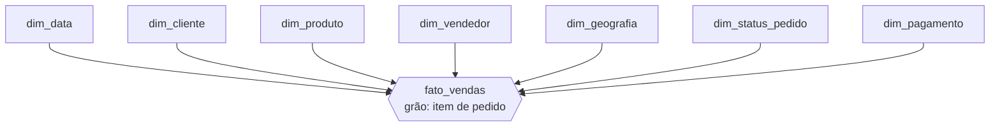
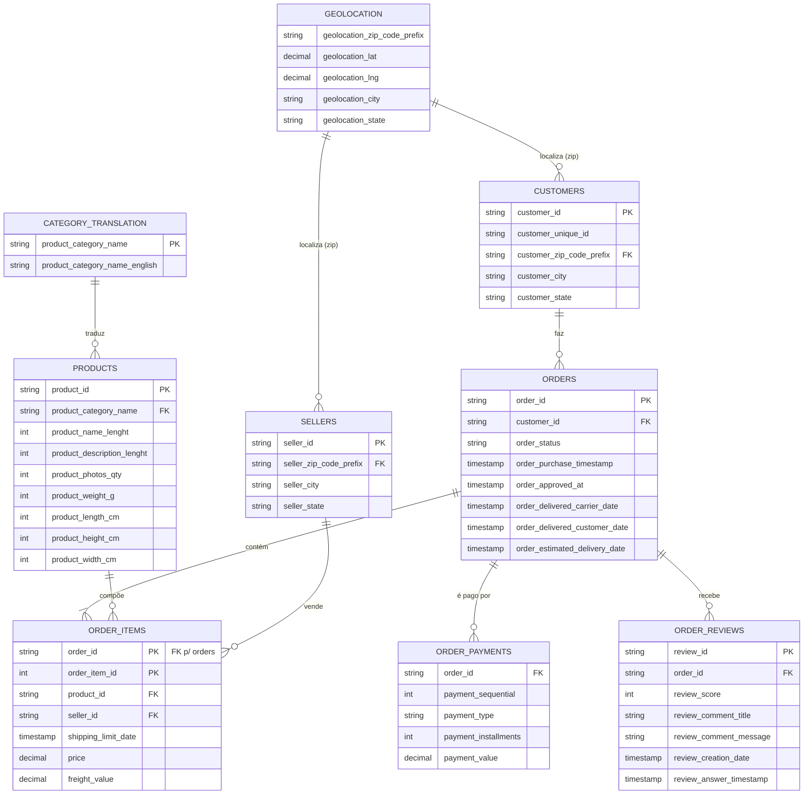
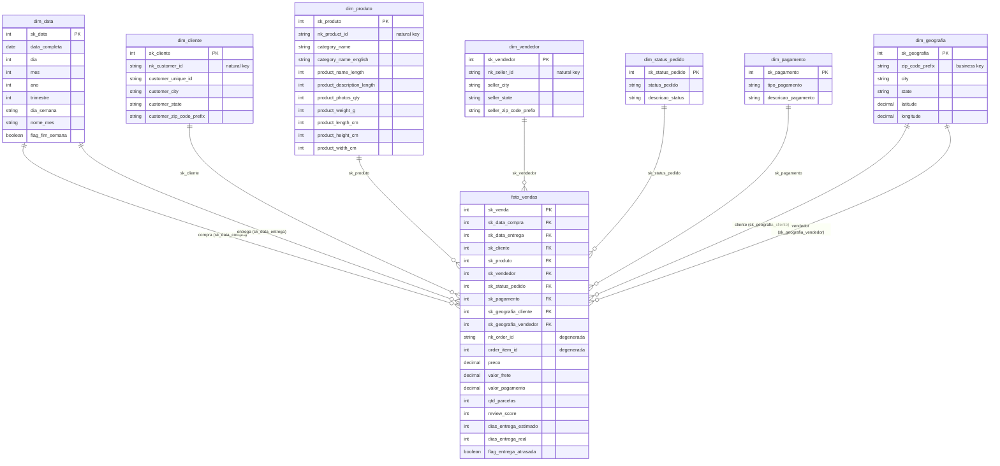

# Etapa 1 — Modelagem Dimensional (Data Warehouse Olist)

Documentação arquitetural do Data Warehouse construído sobre os dados públicos da
Olist. Esta etapa parte do modelo relacional transacional de origem e entrega um
**Star Schema** orientado a performance analítica, implementado em PostgreSQL
(Supabase).

> **Fonte dos dados:** [github.com/olist/work-at-olist-data](https://github.com/olist/work-at-olist-data)
> — arquivos CSV disponíveis localmente em [`datasets/`](../datasets/).

## Índice

1. [Escopo do Projeto](#1-escopo-do-projeto)
2. [Granularidade da Tabela de Fatos](#2-granularidade-da-tabela-de-fatos)
3. [Modelo Dimensional de Alto Nível (1.1)](#3-modelo-dimensional-de-alto-nível-11)
4. [Modelo Relacional de Origem](#4-modelo-relacional-de-origem)
5. [Modelo Dimensional Detalhado — DER Físico (1.2-B)](#5-modelo-dimensional-detalhado--der-físico-12-b)
6. [Documentação Detalhada das Tabelas (1.2-A)](#6-documentação-detalhada-das-tabelas-12-a)
7. [Qualidade de Dados e Transformações](#7-qualidade-de-dados-e-transformações)
8. [Artefatos da Etapa](#8-artefatos-da-etapa)

---

## 1. Escopo do Projeto

O objetivo é desenvolver uma arquitetura moderna de dados na nuvem que transforme os
dados transacionais da Olist em um modelo analítico capaz de responder a perguntas de
negócio sobre **vendas, logística e satisfação do cliente**.

**Dentro do escopo da Etapa 1 (Modelagem):**

- Análise das 9 tabelas relacionais de origem (pedidos, itens, pagamentos, avaliações,
  clientes, vendedores, produtos, geolocalização e tradução de categorias).
- Desenho de um **Star Schema** com 1 tabela de fatos e 7 dimensões.
- Definição de granularidade, surrogate keys, atributos, domínios e tipos de SCD.
- Implementação física (DDL) e documentação detalhada (planilhas + DER).

**Processo de negócio modelado:** a venda de itens em pedidos do marketplace — desde a
compra, passando pelo pagamento e logística de entrega, até a avaliação do cliente.

---

## 2. Granularidade da Tabela de Fatos

> **Grão: 1 linha da `fato_vendas` = 1 item de um pedido.**

A chave natural do grão é a combinação **`order_id` + `order_item_id`** (proveniente de
`olist_order_items_dataset.csv`). Essa é a menor unidade transacional que conecta
simultaneamente um **cliente**, um **produto**, um **vendedor**, uma **data**, um
**status** e um **pagamento** — sendo o nível ideal para análises de receita, frete e
desempenho logístico.

Escolhas decorrentes do grão:

- Métricas aditivas (`preco`, `valor_frete`) são naturais no nível de item.
- `valor_pagamento` é **rateado proporcionalmente** por item (ver
  [Qualidade de Dados](#7-qualidade-de-dados-e-transformações)).
- `review_score` é tratado como métrica **semi-aditiva** (válida por pedido, não somável).

---

## 3. Modelo Dimensional de Alto Nível (1.1)

Visão simplificada do Star Schema — a tabela de fatos central conectada às sete
dimensões, sem detalhamento de atributos.

| Dimensão | Papel analítico |
|---|---|
| `dim_data` | Tempo (compra e entrega) — usada 2x via role-playing |
| `dim_cliente` | Quem comprou |
| `dim_produto` | O que foi vendido (categoria, dimensões físicas) |
| `dim_vendedor` | Quem vendeu (lojista parceiro) |
| `dim_geografia` | Onde (localização de cliente e vendedor via CEP) |
| `dim_status_pedido` | Situação do pedido |
| `dim_pagamento` | Como foi pago |

---

## 4. Modelo Relacional de Origem

Modelo transacional bruto fornecido pela Olist. É o ponto de partida da transformação:
9 tabelas normalizadas que serão desnormalizadas no Star Schema.

**Mapeamento origem → dimensional (resumo):**

| Origem | Destino dimensional |
|---|---|
| `olist_orders` + `olist_order_items` | `fato_vendas` (grão de item) |
| `olist_orders.order_purchase/_delivered` | `dim_data` (role-playing) |
| `olist_customers` | `dim_cliente` |
| `olist_products` + `category_translation` | `dim_produto` |
| `olist_sellers` | `dim_vendedor` |
| `olist_geolocation` | `dim_geografia` (agregado por CEP) |
| `olist_orders.order_status` | `dim_status_pedido` |
| `olist_order_payments.payment_type` | `dim_pagamento` |
| `olist_order_payments`, `olist_order_reviews` | métricas da `fato_vendas` |

---

## 5. Modelo Dimensional Detalhado — DER Físico (1.2-B)

DER completo do Star Schema com todos os atributos, chaves primárias (PK) e chaves
estrangeiras/substitutas (SK) que formam os relacionamentos. Cada FK na `fato_vendas`
contém o valor da SK da dimensão correspondente. Fonte física: [`sql/01_schema.sql`](../sql/01_schema.sql).

**Notas de modelagem:**

- **Role-playing dimension:** `dim_data` é referenciada duas vezes (`sk_data_compra` e
  `sk_data_entrega`).
- **Dimensão degenerada:** `nk_order_id` e `order_item_id` permanecem na fato para
  rastreabilidade ao pedido original (sem dimensão própria).
- **Surrogate keys:** todas as dimensões usam SK numérica (`SERIAL`), exceto `dim_data`,
  cuja SK é inteligente no formato `YYYYMMDD`.
- **Registro -1:** cada dimensão possui um membro `-1` ("N/A") para tratar fatos sem
  correspondência (ex.: pedido não entregue → `sk_data_entrega = -1`).

---

## 6. Documentação Detalhada das Tabelas (1.2-A)

Cada tabela possui uma aba dedicada na
**[planilha de mapeamento (Google Sheets)](https://docs.google.com/spreadsheets/d/1pjmR3teW512zpyd4wkox4JWPSOrz8AR-k7yAkT8H_Xs/edit?usp=sharing)**
com: **nome do atributo/fato**, **descrição**, **valores de amostra** e **indicador de
tipo de SCD**.

| Tabela | Tipo | SCD predominante | Aba na planilha |
|---|---|---|---|
| `fato_vendas` | Fato | — (transacional) | `fato_vendas` |
| `dim_data` | Dimensão | Tipo 0 (fixa) | `dim_data` |
| `dim_cliente` | Dimensão | Tipo 1 (sobrescreve) | `dim_cliente` |
| `dim_produto` | Dimensão | Tipo 1 (sobrescreve) | `dim_produto` |
| `dim_vendedor` | Dimensão | Tipo 1 (sobrescreve) | `dim_vendedor` |
| `dim_geografia` | Dimensão | Tipo 0 (fixa) | `dim_geografia` |
| `dim_status_pedido` | Dimensão | Tipo 0 (fixa) | `dim_status_pedido` |
| `dim_pagamento` | Dimensão | Tipo 0 (fixa) | `dim_pagamento` |

### Domínios validados

Os domínios das dimensões de baixa cardinalidade foram conferidos contra os valores
distintos reais dos CSVs de origem:

- **`dim_status_pedido`** (8 valores): `delivered`, `shipped`, `canceled`, `invoiced`,
  `processing`, `created`, `approved`, `unavailable`.
- **`dim_pagamento`** (5 valores): `credit_card`, `boleto`, `voucher`, `debit_card`,
  `not_defined`.

---

## 7. Qualidade de Dados e Transformações

Questões de qualidade identificadas na origem e as transformações aplicadas na carga:

| Tema | Problema na origem | Tratamento |
|---|---|---|
| **Categorias nulas** | `product_category_name` ausente em alguns produtos | Mapeado para `category_name = 'sem_categoria'` / `category_name_english = 'unknown'` |
| **Tradução de categoria** | Categoria só em português na origem | Join com `product_category_name_translation` para popular `category_name_english` |
| **Pedidos sem entrega** | `order_delivered_customer_date` nulo (pedido cancelado/em trânsito) | `sk_data_entrega = -1`; `dias_entrega_real = NULL` |
| **Clientes recorrentes** | `customer_id` muda por pedido; `customer_unique_id` é estável | `customer_unique_id` mantido na dimensão para deduplicação analítica |
| **Geolocalização duplicada** | Múltiplas coordenadas por prefixo de CEP | `dim_geografia` agrega por CEP usando **média** de lat/lng |
| **Membros ausentes** | Fatos sem dimensão correspondente | Registro `-1` ("N/A") em todas as dimensões |
| **SLA de entrega** | Não existe na origem | Calculado: `dias_entrega_*` e `flag_entrega_atrasada` (real > estimada) |

### Limitação conhecida — rateio de pagamento

A granularidade da fato é **item de pedido**, mas os pagamentos
(`olist_order_payments`) existem no nível de **pedido** — um pedido pode ter múltiplos
pagamentos (ex.: parte em voucher, parte em cartão) e um pagamento cobre vários itens.

Como não há vínculo direto pagamento → item na origem, `valor_pagamento` é **rateado
proporcionalmente** ao `preco` de cada item dentro do pedido. Implicações:

- A **soma** de `valor_pagamento` na fato reconcilia com o total pago por pedido.
- O valor por **linha individual** é uma aproximação, não um pagamento real do item.
- `tipo_pagamento` por item assume o pagamento de maior valor do pedido quando há mais
  de um método (pagamento dominante).

Análises que exijam exatidão de pagamento devem agregar no nível de `nk_order_id`.

---

## 8. Artefatos da Etapa

| Artefato | Descrição |
|---|---|
| [`sql/01_schema.sql`](../sql/01_schema.sql) | DDL completo (schemas `dw` + `stg`): tabelas, PKs, FKs, índices, carga das dimensões fixas e membros `-1` |
| [Planilha de mapeamento (Google Sheets)](https://docs.google.com/spreadsheets/d/1pjmR3teW512zpyd4wkox4JWPSOrz8AR-k7yAkT8H_Xs/edit?usp=sharing) | 8 abas de documentação detalhada (fato + 7 dimensões) |

> Todos os diagramas oficiais deste projeto estão em **Mermaid**, embutidos neste documento.
