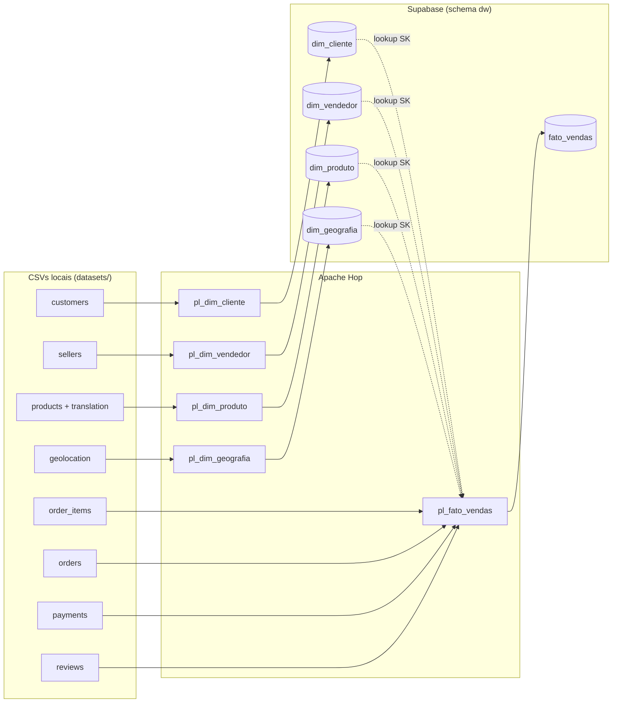

# Etapa 2 — Pipeline de ETL (Local → Nuvem) com Apache Hop

Esta etapa lê os CSVs locais da Olist ([`datasets/`](../datasets/)), trata os dados,
**gera as surrogate keys no Hop** e carrega o Star Schema no **Supabase**, cuidando da
latência de rede com cargas em lote (*commit size*).

> **Fluxo:** `CSVs locais → Apache Hop (extrai, limpa, gera SK) → Supabase (schema dw)`
> **Ordem obrigatória:** dimensões primeiro, fato depois (por causa das FKs).

## Índice
1. [Artefatos](#1-artefatos)
2. [Arquitetura do pipeline](#2-arquitetura-do-pipeline)
3. [Passos para criar o banco](#3-passos-para-criar-o-banco)
4. [Tutorial — Apache Hop em Docker](#4-tutorial--apache-hop-em-docker)
5. [Tutorial — Conexão JDBC](#5-tutorial--conexão-jdbc)
6. [Pipelines de dimensões](#6-pipelines-de-dimensões)
7. [Pipeline da fato](#7-pipeline-da-fato)
8. [Workflows](#8-workflows)
9. [Execução e validação](#9-execução-e-validação)
10. [Notas de qualidade de dados](#10-notas-de-qualidade-de-dados)

---

## 1. Artefatos

```
docker-compose.yml                 # Hop em container (hop-web + hop-run)
sql/01_schema.sql                  # DDL do Star Schema (schemas dw + stg)
etl/
├── pipelines/                     # .hpl
│   ├── pl_dim_cliente.hpl
│   ├── pl_dim_vendedor.hpl
│   ├── pl_dim_produto.hpl
│   ├── pl_dim_geografia.hpl
│   ├── pl_stg_orders.hpl
│   ├── pl_stg_order_items.hpl
│   ├── pl_stg_payments.hpl
│   └── pl_stg_reviews.hpl
├── workflows/                     # .hwf
│   ├── wf_dimensoes.hwf
│   ├── wf_staging.hwf
│   └── wf_carga_completa.hwf      # orquestrador final
├── metadata/rdbms/supabase_dw.json # conexão JDBC (referenciada pelos pipelines)
├── config/dev-config.json.example  # modelo das credenciais (copie p/ dev-config.json)
└── project-config.json            # projeto Hop + variáveis ${SUPABASE_*}
```

| Artefato | Link |
|---|---|
| DDL | [`sql/01_schema.sql`](../sql/01_schema.sql) |
| Pipeline dim_cliente | [`etl/pipelines/pl_dim_cliente.hpl`](../etl/pipelines/pl_dim_cliente.hpl) |
| Pipeline dim_vendedor | [`etl/pipelines/pl_dim_vendedor.hpl`](../etl/pipelines/pl_dim_vendedor.hpl) |
| Pipeline dim_produto | [`etl/pipelines/pl_dim_produto.hpl`](../etl/pipelines/pl_dim_produto.hpl) |
| Pipeline dim_geografia | [`etl/pipelines/pl_dim_geografia.hpl`](../etl/pipelines/pl_dim_geografia.hpl) |
| Pipeline stg_orders | [`etl/pipelines/pl_stg_orders.hpl`](../etl/pipelines/pl_stg_orders.hpl) |
| Pipeline stg_order_items | [`etl/pipelines/pl_stg_order_items.hpl`](../etl/pipelines/pl_stg_order_items.hpl) |
| Pipeline stg_payments | [`etl/pipelines/pl_stg_payments.hpl`](../etl/pipelines/pl_stg_payments.hpl) |
| Pipeline stg_reviews | [`etl/pipelines/pl_stg_reviews.hpl`](../etl/pipelines/pl_stg_reviews.hpl) |
| Workflow dimensões | [`etl/workflows/wf_dimensoes.hwf`](../etl/workflows/wf_dimensoes.hwf) |
| Workflow staging | [`etl/workflows/wf_staging.hwf`](../etl/workflows/wf_staging.hwf) |
| Workflow carga completa | [`etl/workflows/wf_carga_completa.hwf`](../etl/workflows/wf_carga_completa.hwf) |
| Docker Compose | [`docker-compose.yml`](../docker-compose.yml) |
| Conexão JDBC (metadata) | [`etl/metadata/rdbms/supabase_dw.json`](../etl/metadata/rdbms/supabase_dw.json) |

---

## 2. Arquitetura do pipeline



> `dim_data`, `dim_status_pedido` e `dim_pagamento` são **dimensões fixas** já carregadas
> pelo próprio [`01_schema.sql`](../sql/01_schema.sql) — não precisam de pipeline.

---

## 3. Passos para criar o banco

A criação do Data Warehouse usa **dois** arquivos SQL, executados em momentos diferentes do pipeline:

| Arquivo | Quando rodar | O que faz |
|---|---|---|
| [`sql/01_schema.sql`](../sql/01_schema.sql) | **antes** do Hop | Dropa e recria tudo do zero: schemas `dw` + `stg`, as 8 tabelas dimensionais/fato (com dims fixas já populadas), as 4 tabelas de staging e os índices de join. |
| [`sql/02_fato.sql`](../sql/02_fato.sql) | **depois** do Hop | Monta `dw.fato_vendas` via `INSERT...SELECT` a partir do staging + dimensões. Idempotente (faz `TRUNCATE` antes). |

Sequência completa: **`01_schema.sql` → Hop (dims + staging) → `02_fato.sql`**.

**Como executar cada arquivo** — duas opções:

*Opção A — SQL Editor do Supabase* (bom para o `01_schema.sql`, que é rápido):
1. Menu → **SQL Editor** → **New query**.
2. Cole o conteúdo do arquivo e clique em **Run**.
3. Em **Table Editor** (schema `dw`) confira as tabelas; `dim_data`, `dim_status_pedido` e `dim_pagamento` já devem ter linhas.

*Opção B — `psql` via Docker* (recomendado para o `02_fato.sql`):
O editor web faz a requisição por `api.supabase.com` e **estoura o timeout em queries longas** (erro `Failed to fetch`). O `02_fato.sql` é um `INSERT` pesado (~112 mil linhas com vários joins/agregações), então rode-o conectando direto no **Session Pooler**, que ignora o dashboard:
```bash
docker run --rm -i -v "$PWD/sql:/sql" postgres:16 \
  psql "postgresql://${SUPABASE_USER}:${SUPABASE_PASS}@${SUPABASE_HOST}:5432/postgres?sslmode=require" \
  -v ON_ERROR_STOP=1 -f /sql/02_fato.sql
```
> Use a **porta 5432** (Session pooler) para arquivos multi-statement. Substitua
> `${SUPABASE_USER}`, `${SUPABASE_PASS}` e `${SUPABASE_HOST}` pelos valores do
> `etl/config/dev-config.json`. O mesmo comando serve para o `01_schema.sql`
> (troque o `-f` para `/sql/01_schema.sql`).

Ao final, o `02_fato.sql` imprime a contagem das dimensões e da fato (`fato_vendas` ≈ **112.650**).

---

## 4. Tutorial — Apache Hop em Docker

O Apache Hop roda em container (não precisa instalar Java nem o Hop localmente — só
**Docker** e **Docker Compose**). O [`docker-compose.yml`](../docker-compose.yml) define
dois serviços:

| Serviço | Imagem | Para quê |
|---|---|---|
| `hop-web` | `apache/hop-web` | GUI no navegador (desenhar/editar/rodar pela tela) |
| `hop-run` | `apache/hop` | Execução **headless** do workflow completo |

A pasta `./etl` é montada como projeto em `/project` e `./datasets` em `/datasets`.
Como `DATASETS_DIR = ${PROJECT_HOME}/../datasets` e `PROJECT_HOME = /project`, os CSVs são
encontrados em `/datasets` automaticamente.

**4.1 Credenciais (uma vez)**

Os arquivos com credenciais **não são versionados** (estão no `.gitignore`); o repositório
traz apenas os modelos `*.example`. Em um clone novo, copie e preencha:
```bash
cp etl/project-config.json.example      etl/project-config.json
cp etl/config/dev-config.json.example   etl/config/dev-config.json
# edite os dois com as credenciais reais do Supabase
```

> `project-config.json` é lido sempre que o projeto abre (GUI e headless).
> `dev-config.json` é o ambiente `dev` usado pelo `hop-run`. Mantenha os dois iguais.

**4.2 GUI no navegador (hop-web)**

> O container roda com um usuário diferente do seu; libere a escrita na pasta do projeto
> **antes** de subir, senão o Hop não consegue criar as pastas de metadata:
> ```bash
> chmod -R 777 etl
> ```

```bash
docker compose up -d hop-web
```
Abra **http://localhost:8080/ui**. O hop-web **não registra o projeto sozinho** — ele abre
com `default`/`samples`. Adicione o nosso uma vez:

1. Clique no **`+` verde** (canto superior esquerdo) → *Add a new project*.
2. **Name:** `olist-etl` · **Home folder:** `/project` · config: `project-config.json`.
3. Se pedir ambiente: **Name** `dev`, config file `/project/config/dev-config.json`.

Para parar: `docker compose down`.

**4.3 Execução headless (hop-run)** — ver [Seção 9](#9-execução-e-validação).

---

## 5. Tutorial — Conexão JDBC

A conexão `supabase_dw` **já vem pronta** no projeto, em
[`etl/metadata/rdbms/supabase_dw.json`](../etl/metadata/rdbms/supabase_dw.json). Ela usa
as variáveis `${SUPABASE_*}` (preenchidas em `dev-config.json`) e já inclui a opção
`sslmode = require`. Os pipelines a referenciam pelo nome `supabase_dw`.

Para conferir/testar na GUI (hop-web): aba **Metadata → Relational Database Connection →
supabase_dw → Test** → deve retornar *Connection OK*.

> Se o *Test* falhar com **timeout**, você provavelmente está usando a *Direct connection*
> (IPv6). Troque `SUPABASE_HOST` para o **Session Pooler** (Seção 4.1).

---

## 6. Pipelines de dimensões

Padrão: **CSV Input → (transformação) → Add sequence (SK) → Table Output (commit size)**.

A surrogate key é gerada **no Hop** pelo step *Add sequence*, que consome a sequence do
`SERIAL` já criada pelo DDL (ex.: `dw.dim_cliente_sk_cliente_seq`) — atendendo ao
requisito "gerar chaves substitutas no Hop antes da carga".

| Pipeline | Origem | Transformações |
|---|---|---|
| `pl_dim_cliente` | `olist_customers` | SK → carga |
| `pl_dim_vendedor` | `olist_sellers` | SK → carga |
| `pl_dim_produto` | `olist_products` + `category_translation` | **Stream Lookup** traduz categoria; **If Null** → `sem_categoria`/`unknown`; SK → carga |
| `pl_dim_geografia` | `olist_geolocation` | **Memory Group By** por CEP (média lat/lng, 1ª cidade/UF); SK → carga |

---

## 7. Pipeline da fato

`pl_fato_vendas` — grão = **1 item de pedido**. Transformações principais:

```mermaid
flowchart LR
    A[items_csv] --> LO[lk_orders]
    LO --> LP[lk_payments]
    LP --> LR[lk_reviews]
    LR --> LPR[lk_precos]
    LPR --> LC[lk_customers]
    LC --> LS[lk_sellers]
    LS --> CD[conv_datas]
    CD --> CF[calc_campos]
    CF --> SK1[lk_sk_cliente]
    SK1 --> SK2[lk_sk_produto]
    SK2 --> SK3[lk_sk_vendedor]
    SK3 --> SK4[lk_sk_status]
    SK4 --> SK5[lk_sk_pagamento]
    SK5 --> SK6[lk_sk_geo_cliente]
    SK6 --> SK7[lk_sk_geo_vendedor]
    SK7 --> OUT[(fato_vendas)]
```



1. **Enriquecimento** (Stream Lookup em memória): pedido (`orders`), pagamento agregado por pedido (soma do valor, parcela máxima, tipo dominante), nota máxima da avaliação, soma de preço do pedido (base do rateio) e CEP de cliente/vendedor.
2. **Datas → chaves** (`conv_datas` + `calc_campos`): `sk_data_compra`/`sk_data_entrega` calculadas direto como `YYYYMMDD` (a SK de data é inteligente; entrega nula → `-1`).
3. **Métricas calculadas:** `dias_entrega_estimado`, `dias_entrega_real`, `flag_entrega_atrasada` e `valor_pagamento` (rateio proporcional ao preço do item).
4. **Resolução das SKs** (Database Lookup com cache total): cliente, produto, vendedor, status, pagamento e geografia (cliente/vendedor). Sem correspondência → `-1`.
5. **Carga** em `dw.fato_vendas` com **commit size 5000**.

---

## 8. Workflows

| Workflow | Encadeamento |
|---|---|
| `wf_dimensoes` | `Start → pl_dim_cliente → pl_dim_vendedor → pl_dim_produto → pl_dim_geografia → Success` |
| `wf_fatos` | `Start → pl_fato_vendas → Success` |
| `wf_carga_completa` | `Start → wf_dimensoes → wf_fatos → Success` |

---

## 9. Execução e validação

**Pré-condições:** `01_schema.sql` já executado no Supabase (Seção 3) e `etl/config/dev-config.json` preenchido (Seção 4.1).

**Opção A — Headless via Docker (recomendado para a carga final):**
```bash
docker compose run --rm hop-run
```
O serviço `hop-run` executa o `wf_carga_completa.hwf` (dimensões → fato) e encerra ao
terminar. Os logs aparecem no terminal. Para rodar só uma parte, sobrescreva o arquivo:
```bash
docker compose run --rm -e HOP_FILE_PATH='${PROJECT_HOME}/workflows/wf_dimensoes.hwf' hop-run
```

**Opção B — Pela GUI (hop-web):** com `docker compose up -d hop-web`, abra
http://localhost:8080/ui, abra [`wf_carga_completa.hwf`](../etl/workflows/wf_carga_completa.hwf) e clique em **Run**.

**Validação (SQL Editor do Supabase):**
```sql
SELECT 'dim_cliente'   t, count(*) FROM dw.dim_cliente
UNION ALL SELECT 'dim_produto',    count(*) FROM dw.dim_produto
UNION ALL SELECT 'dim_vendedor',   count(*) FROM dw.dim_vendedor
UNION ALL SELECT 'dim_geografia',  count(*) FROM dw.dim_geografia
UNION ALL SELECT 'fato_vendas',    count(*) FROM dw.fato_vendas;

-- Itens que não casaram com alguma dimensão (esperado: poucos / zero)
SELECT count(*) AS fato_sem_geo_cliente
FROM dw.fato_vendas WHERE sk_geografia_cliente = -1;
```

---

## 10. Notas de qualidade de dados

| Tema | Tratamento no Hop |
|---|---|
| **Categoria nula** | `If Null` → `sem_categoria` / `unknown` (`pl_dim_produto`) |
| **Geolocalização duplicada** | `Memory Group By` por CEP com **média** de lat/lng (`pl_dim_geografia`) |
| **CEP com zeros à esquerda** | Padronizado para 5 dígitos no `calc_campos` antes do lookup de geografia (`customers`/`sellers` têm o prefixo sem o zero inicial) |
| **Pedido sem entrega** | `sk_data_entrega = -1`; `dias_entrega_real = 0` como sentinela de "não entregue" |
| **Pagamento × grão de item** | `valor_pagamento` rateado proporcionalmente ao preço do item; `tipo_pagamento` = método dominante do pedido (ver limitação na Etapa 1) |
| **Membros ausentes** | Todo lookup de SK retorna `-1` quando não há correspondência |

### Pontos a finalizar na GUI do Hop

Os `.hpl`/`.hwf` são gerados como XML válido e prontos para abrir. Por serem escritos
fora da ferramenta, **verifique na GUI** ao abrir pela primeira vez:

1. A conexão `supabase_dw` já vem em `etl/metadata/rdbms/supabase_dw.json`; teste-a na GUI (Tutorial 5). Se o formato não carregar no seu build do Hop, recrie pela GUI com os mesmos dados.
2. No step **Formula** (`calc_campos`), confirme se as funções `DATEDIF`/`ISBLANK` resolvem no seu build do Hop; ajuste se necessário.
3. As sequences do `SERIAL` existem com os nomes `dw.<tabela>_<sk>_seq` (padrão do PostgreSQL).
4. Rode primeiro `wf_dimensoes` e confira as contagens antes de `wf_fatos`.
