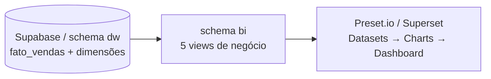

# Etapa 3 — BI e Análise com Preset.io (Apache Superset)

Com o Data Warehouse populado no Supabase (`dw.fato_vendas` = **112.650** linhas), esta
etapa conecta o **Preset.io** ao banco, publica os dados como dashboards e responde às
**5 perguntas de negócio**.

A lógica analítica fica versionada no banco como **views** ([`sql/03_views_bi.sql`](../sql/03_views_bi.sql)),
no schema `bi` — uma view por pergunta. No Preset, cada view vira um *Dataset* direto.


> Dashboard final no Preset.io reunindo as 5 perguntas de negócio: receita por categoria,
> pedidos × frete por estado, evolução de vendas no tempo, % de atraso por estado e
> relação entre nota de avaliação e prazo de entrega.

---

## Índice
1. [Arquitetura da camada de BI](#1-arquitetura-da-camada-de-bi)
2. [Camada de consumo (views SQL)](#2-camada-de-consumo-views-sql)
3. [As 5 perguntas de negócio](#3-as-5-perguntas-de-negócio)
4. [Entregas](#4-entregas)

---

## 1. Arquitetura da camada de BI



Por que **views** em vez de importar as tabelas cruas:
- Os joins e agregações já saem prontos → o *Dataset* no Preset é só selecionar a view.
- A lógica de negócio fica **versionada no Git**, não presa dentro da ferramenta.
- Cada pergunta tem uma fonte única e auditável.

---

## 2. Camada de consumo (views SQL)

Arquivo: [`sql/03_views_bi.sql`](../sql/03_views_bi.sql) — rode **depois** do `02_fato.sql`:

```bash
docker run --rm -i -v "$PWD/sql:/sql" postgres:16 \
  psql "postgresql://${SUPABASE_USER}:${SUPABASE_PASS}@${SUPABASE_HOST}:5432/postgres?sslmode=require" \
  -v ON_ERROR_STOP=1 -f /sql/03_views_bi.sql
```

| View (`bi.`) | Pergunta | Linhas |
|---|---|---|
| `vw_receita_categoria`    | 1 — Receita por categoria | 74 |
| `vw_estado_pedidos_frete` | 2 — Pedidos × frete por estado | 27 |
| `vw_vendas_tempo`         | 3 — Evolução temporal (mensal) | 24 |
| `vw_atraso_entrega`       | 4 — % de atraso por vendedor/região | 2.970 |
| `vw_review_prazo`         | 5 — Nota × prazo de entrega | 5 |

---

## 3. As 5 perguntas de negócio

As perguntas são as definidas no [README.md](../README.md). Abaixo, cada uma com a
**resposta observada nos dados** (amostra da view correspondente).

### 1. Qual a receita total por categoria de produto?
*Fonte:* `bi.vw_receita_categoria`.

Top 5 por receita: **beleza_saude (R$ 1,26 mi)**, relogios_presentes (R$ 1,21 mi),
cama_mesa_banho (R$ 1,04 mi), esporte_lazer (R$ 0,99 mi), informatica_acessorios (R$ 0,91 mi).
`cama_mesa_banho` lidera em **volume** (11,1 mil itens) mas fica atrás em receita — ticket
médio menor. A "cauda longa" de 74 categorias mostra concentração no top ~10.

### 2. Quais estados têm maior volume de pedidos e maior frete médio?
*Fonte:* `bi.vw_estado_pedidos_frete`.

**SP domina**: 41,4 mil pedidos (R$ 5,2 mi) e o **menor frete médio (R$ 15,19)**. Os maiores
fretes médios estão no Norte/Nordeste — RR (R$ 42,98), PB (R$ 42,72), RO (R$ 41,07),
AC (R$ 40,07) — justamente os de **menor volume**. Há uma relação inversa clara entre
volume e custo de frete (distância dos centros logísticos do Sudeste).

### 3. Como evoluiu o volume de vendas ao longo do tempo?
*Fonte:* `bi.vw_vendas_tempo`.

Crescimento forte de 2016 a 2018. **Pico em nov/2017 (7.451 pedidos)** — efeito Black Friday.
Em 2018 o patamar estabiliza em ~6–7 mil pedidos/mês. Os meses 2016-09, 2016-12 e 2018-09
têm contagem residual (bordas do período coberto, dados incompletos).

### 4. Qual o desempenho de entrega (% de atrasos) por vendedor / região?
*Fonte:* `bi.vw_atraso_entrega` (apenas itens entregues).

Por estado do vendedor, **MA se destaca negativamente: 23,6% de atraso** (402 entregas).
SP, apesar do volume gigante (78,6 mil entregas), mantém 8,5%. Estados como AM (66,7%)
têm % alto porém amostra ínfima (3 entregas) — ruído, não tendência.

### 5. Qual a relação entre nota de avaliação e prazo de entrega?
*Fonte:* `bi.vw_review_prazo`.

**Correlação forte e direta**: nota **5** → entrega em **10,6 dias** e só **3,0% de atraso**;
nota **1** → **19,6 dias** e **32,1% de atraso**. Quanto mais demora (e mais atrasa frente ao
prometido), pior a avaliação. É o elo logística → satisfação.

| Nota | Dias de entrega (média) | % atraso |
|---|---|---|
| 5 | 10,6 | 3,0% |
| 4 | 12,2 | 4,9% |
| 3 | 14,0 | 10,3% |
| 2 | 15,7 | 17,9% |
| 1 | 19,6 | 32,1% |

---

## 4. Entregas

| Artefato | Link |
|---|---|
| Views BI (`sql/03_views_bi.sql`) | [arquivo](../sql/03_views_bi.sql) |
| Dashboard Preset.io (export em imagem) | [images/olist-bi.png](../images/olist-bi.png) |
| Dashboard Preset.io (Viewer) | [abrir dashboard](https://7c32dd7b.us2a.app.preset.io/superset/dashboard/8/?native_filters_key=A8kcuDQTpDc) |
| Relatório PDF (análise executiva + dashboard) | [relatorio-etapa3.pdf](relatorio-etapa3.pdf) |
